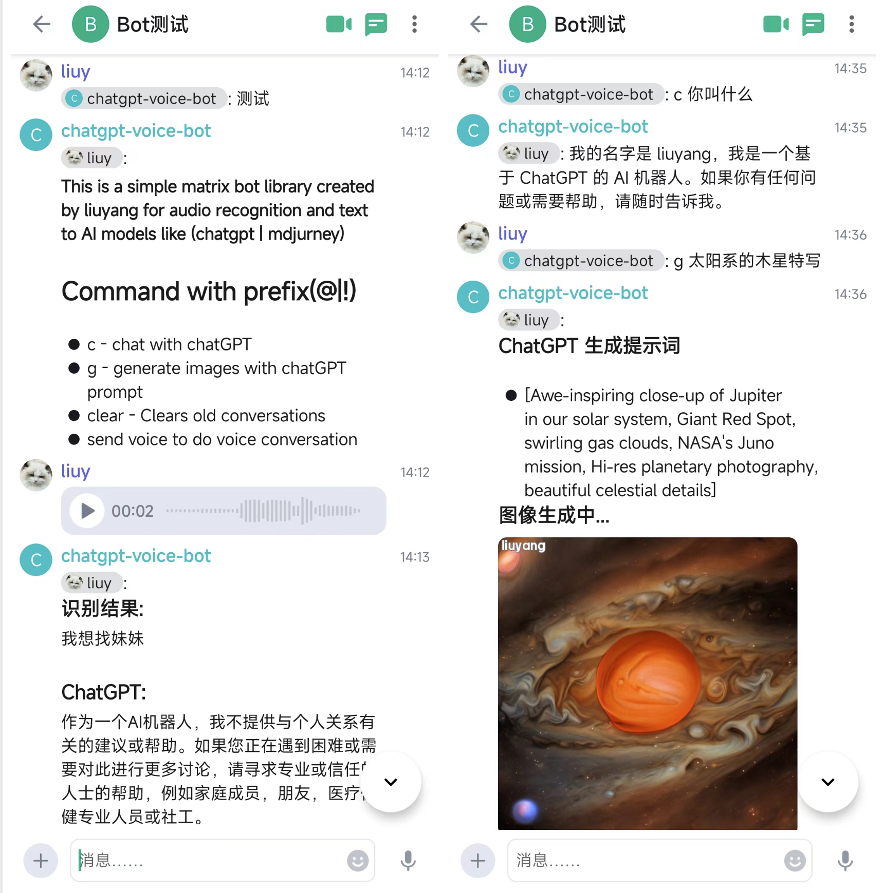

# Matrix ChatGPT Voice Bot

Matrix ChatGPT Voice Bot is a Python GitHub repository that allows users to communicate with an AI
chatbot using voice-to-text technologies powered by OpenAI and to generate images by Midjourney.
It uses the GPT-3.5 Turbo model for generating text and engineering the prompts.



# Supported commands

**Unrestricted commands**

* `help`: Shows this help

**Restricted commands**

* `c`: Chat with the chatGPT.
* `g`: Generate images. Just type `g [description]` and the bot will generate the prompts and images.
* `clear`: Clears the chat history.
* `openai`: reset openai api key
* `replicate`: reset replicate token

# Requirements

+ apt-get install ffmpeg build-essential gcc libolm-dev
+ Python <= 3.10
+ simplematrixbotlib >= 2.8
+ pyyaml
+ openai
+ pydub
+ SpeechRecognition
+ replicate
+ Pillow

# Getting started

## Create a bot account

Then you need to create an account for the bot on the server, like you would do with any other account. A good username
is `chatgpt-voice-bot`. If you want to use token based login, note the access token of the bot. One way to get the token
is to log in as the bot and got to `Settings -> Help & About -> Access Token` in Element, however you mustn't log out or
the token will be invalidated. As an alternative you can use the command

```shell
curl -X POST --header 'Content-Type: application/json' -d '{
    "identifier": { "type": "m.id.user", "user": "YourBotUsername" },
    "password": "YourBotPassword",
    "type": "m.login.password"
}' 'https://matrix.YOURDOMAIN/_matrix/client/r0/login'
```

Once you are finished you can start the installation of the bot.

## Installation (manual)

The installation can easily be done via pip. It is recommended to use a virtual environment.

```bash
$ pip install .
```

### Configuration

Configure the bot with a file named `config/config.toml`. It should look like this

```yaml
[ simplematrixbotlib.config ]
  description = "This is a simple matrix bot library created by liuyang for audio recognition and text to AI models like (chatgpt | mdjurney)"

  HOMESERVER = "https://matrix.example.com"
  USERNAME = ""
  PASSWORD = ""
  ACCESS_TOKEN = ""
  OPEN_AI_KEY = ""
  ENABLE_ENCRYPTION = "true"
  REPLICATE_API_TOKEN = "" # key from replicate
```

It is also possible to use environment variables to configure the bot. The variable names are all upper or lower case.

### Start the bot

Start the bot with

```bash
python -m matrix_chatgpt_voice_bot.main
```

and then open a Direct Message to the bot. The type one of the following commands.

## Install using docker (recommended)

```
docker run -d --name matrix-chatgpt-voice-bot \
  -e HOMESERVER="https://synapse.example.com" \
  -e USERNAME="chatgpt-voice-bot" \
  -e PASSWORD="password" \
  -e ACCESS_TOKEN="" \
  -e OPEN_AI_KEY="" \
  -e REPLICATE_API_TOKEN="" \
  -e ENABLE_ENCRYPTION="true" \
  ly1998117/matrix-chatgpt-voice-bot:latest
```

If you use `ACCESS_TOKEN` you can leave `PASSWORD` empty. The `OPEN_AI_KEY` and `REPLICATE_API_TOKEN` is optional, you
can leave it empty and reset them with the `openai` and `replicate` commands to the bot.

## Install using docker-compose

To use this container via docker you can create the following `docker-compose.yml` and start the container
with `docker-compose up -d`. Explanation on how to obtain the correct values of the configuration can be found in the
**Manual installation** section.

``` yaml
version: "3.7"

services:
  matrix-chatgpt-voice-bot:
    image: ly1998117/matrix-chatgpt-voice-bot:latest
    environment:
      LOGGING_LEVEL: DEBUG
      HOMESERVER: "https://synapse.example.com"
      USERNAME: "chatgpt-voice-bot"
      PASSWORD: "password"
      ACCESS_TOKEN: ""
      ENABLE_ENCRYPTION: "true"
      OPEN_AI_KEY: ""
      REPLICATE_API_TOKEN: "" # key from replicate
```

### Automatically (re-)start the bot with Systemd

To have the bot start automatically after reboots create the file `/etc/systemd/system/matrix-chatgpt-voice-bot.service`
with the following content on your server. This assumes you use that you place your configuration in
`/matrix/config/config.yml` and the bot in `/matrix`. If you use a different location, adjust the paths accordingly.

```
[Unit]
Description=matrix-chatgpt-voice-bot

[Service]
Type=simple

WorkingDirectory=/matrix
ExecStart=python3 -m matrix_chatgpt_voice_bot.main

Restart=always
RestartSec=30
SyslogIdentifier=matrix-chatgpt-voice-bot

[Install]
WantedBy=multi-user.target
```

After creating the service reload your daemon and start+enable the service.

```bash
$ sudo systemctl daemon-reload
$ sudo systemctl start matrix-chatgpt-voice-bot
$ sudo systemclt enable matrix-chatgpt-voice-bot
```

# End-to-End Encryption

The bot supports E2E encryption now. This is a bit safer and also allows to create direct messages (which
are by default encrypted).
This will be enabled by default.

# Related Projects

* The project is made possible by [Simple-Matrix-Bot-Lib](https://simple-matrix-bot-lib.readthedocs.io).

